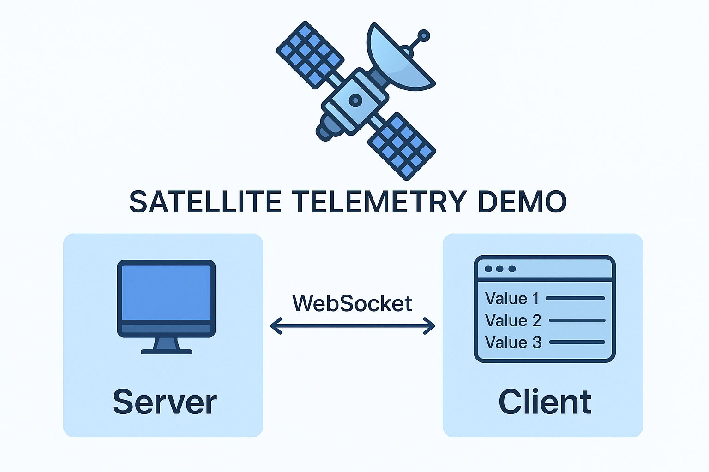

# Satellite Telemetry Demo in Real-Time

<p align="center">
  
</p>

### Backend: C++17 with [uWebSockets](https://github.com/uNetworking/uWebSockets)/[uSockets](https://github.com/uNetworking/uSockets/tree/182b7e4fe7211f98682772be3df89c71dc4884fa) (libuv, OpenSSL, zlib). Publishes JSON on a topic via WebSocket.

### Frontend: React (Vite) that subscribes and charts values.

<p align="center">
  
</p>


### Project Layout
```
.
├─ backend-server/
│  ├─ CMakeLists.txt
│  ├─ src/
│  │  └─ main.cpp
│  └─ external/
│     └─ uWebSockets/      # vendor checkout (includes uSockets)
└─ telemetry-ui-front-end/
   ├─ src/App.jsx
   ├─ src/useTelemetry.js
   └─ .env.local            # set VITE_WS_URL here
```

### Back-End Setup

**Clone uWebSockets inside `backend-server/external/`**
    ```bash
    cd backend-server/external/
    git clone --recursive https://github.com/uNetworking/uWebSockets.git

    cd ../../backend-server
    mkdir build && cd build
    cmake ..
    make

    ./MyUWSApp

If you want, I can merge this with your **front-end** setup into a complete README so the whole project is documented in one place. That way someone could clone and get both parts running without guessing the steps.


